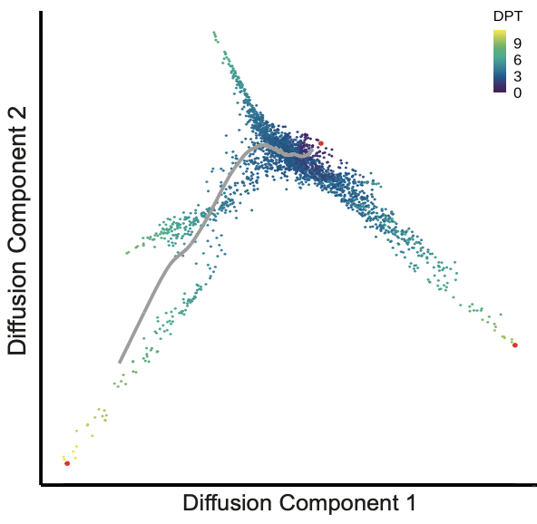
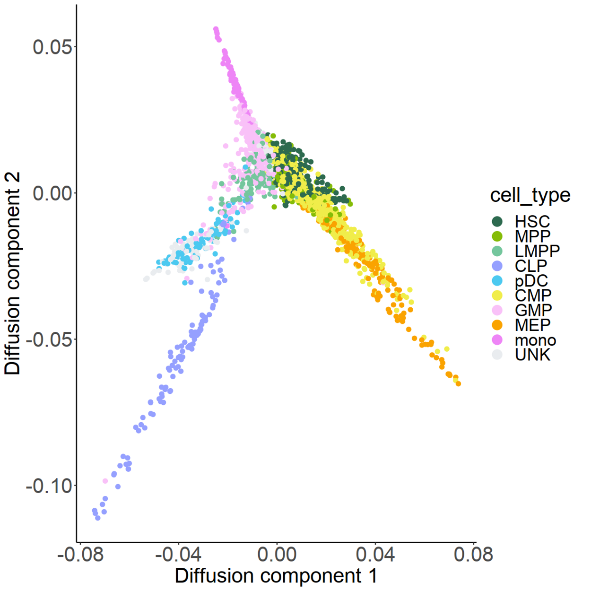

Hematopoietic Stem Cells (HSC) 
==============================

To prove that SCRIP can infer TR activities in a complex system and could be potentially used to track cell differentiation, we applied SCRIP on a human hematopoietic stem cell (HSC) differentiation scATAC-seq dataset `(Jason et al., Cell, 2018) <https://doi.org/10.1016/j.cell.2018.03.074>`_. Data was downloaded from GEO with accession `GSE96769 <https://www.ncbi.nlm.nih.gov/geo/query/acc.cgi?acc=GSE96769>`_.

.. code:: shell

    SCRIP enrich -i example/HSC/data/HSC_peak_count.h5 -s hs -p example/HSC/SCRIP -t 32

.. code:: R

    library(Seurat)
    library(destiny)
    library(dplyr)
    library(ggplot2)

    enri<-read.table("example/HSC/SCRIP/enrichment/SCRIP_enrichment.txt",header=T)
    meta<-read.table("example/HSC/data/metadata.txt")
    meta[which(meta$assign.celltype=="MCP"),7]<-"pDC"
    enri<-enri[rownames(enri)%in%rownames(meta),]
    enri_b<-t(enri)

    seurat <- CreateSeuratObject(counts = enri_b, project = "hsc")
    seurat@assays$RNA@scale.data<-as.matrix(seurat@assays$RNA@counts)
    seurat <- FindVariableFeatures(seurat, selection.method = "vst", nfeatures = 2000)
    seurat <- RunPCA(seurat, features = VariableFeatures(object = seurat))

    seurat <- FindNeighbors(seurat, dims = 1:25)
    seurat <- FindClusters(seurat, resolution = 0.7)
    seurat <- RunUMAP(seurat, dims = 1:50)

.. code:: R

    logcounts <- GetAssayData(seurat, "data")

    # Choose the top 600 most variable TFs to do the trajectory analysis.
    feature<-sort(apply(logcounts,1,var),decreasing=TRUE)[1:600] 
    feature<-rownames(as.data.frame(feature))
    input_matrix <- t(as.matrix(logcounts[feature, ]))

    dm <- DiffusionMap(as.matrix(input_matrix),k=4) 
    cell_type<-as.data.frame(seurat@active.ident)
    colnames(cell_type)<-"cell_type"
    seurat@meta.data$cell_type<-cell_type$cell_type

    options(repr.plot.width = 10, repr.plot.height = 10)
    set.seed(2020)
    dpt <- DPT(dm,tips=1)
    c=plot(dpt, 1:2)
    c+theme_classic()

.. code:: R

    tmp <- data.frame(DC1 = dm$DC1,
                     DC2 = dm$DC2,
                     timepoint = cell_type,
                     dpt = dpt$DPT1)    
    set.seed(2020)
    options(repr.plot.width = 10, repr.plot.height = 10)
    p<-ggplot(tmp, aes(x = DC1, 
                    y = DC2, 
                    colour = cell_type)) +
        geom_point(size=2)+ 
        xlab("Diffusion component 1") + 
        ylab("Diffusion component 2") +
        theme_classic()
    figure1<-p+ scale_color_manual(values=c(HSC="#2D6A4F",MPP="#85BC07",LMPP="#74c69d",
                CLP="#95A0FF",pDC="#4cc9f0",CMP="#F0ED4A",
                GMP="#F9C1F8",MEP="#FAA300",mono="#EE85F6",UNK="#e9ecef"))+
                theme(axis.title=element_text(size=25),axis.text=element_text(size=25),
                    legend.text=element_text(size=20),legend.title=element_text(size=25),text = element_text(family="myfont"))+
                guides(colour = guide_legend(override.aes = list(size=5)))
    figure1

