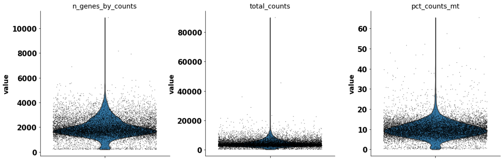
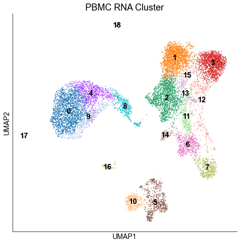
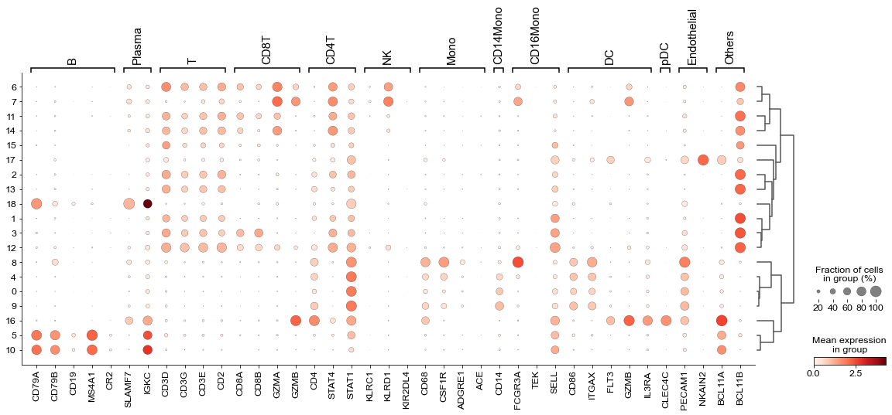
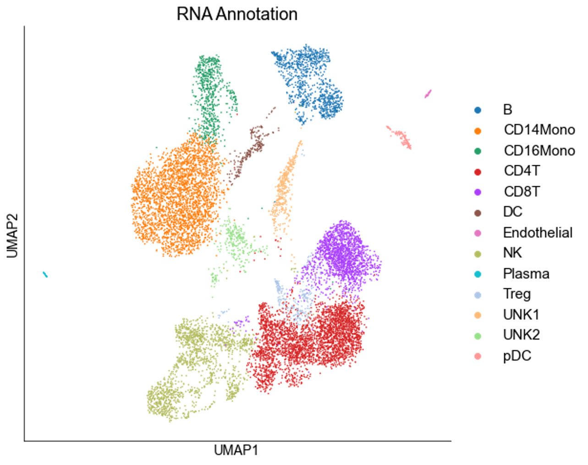
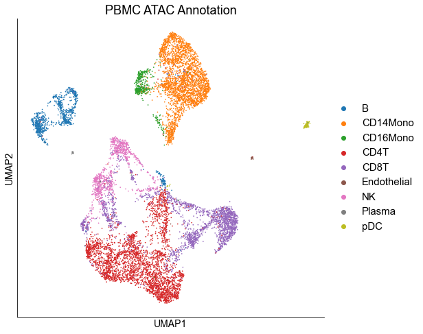
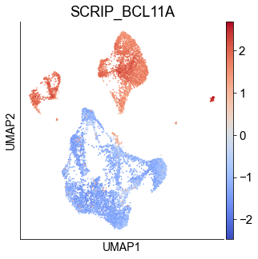

Peripheral Blood Mononuclear Cells (PBMC) 
==========================================

The PBMC multiome data was downloaded on the `10X genomics website <https://www.10xgenomics.com/resources/datasets/pbmc-from-a-healthy-donor-granulocytes-removed-through-cell-sorting-10-k-1-standard-2-0-0>`_. We downloaded the h5 file of scRNA-seq and scATAC-seq and processed with following codes. 

Since there is no annotation in scRNA-seq data, we first annatate the scRNA-seq dataset. First, We used the scanpy to perform the basic QC for scRNA-seq.

.. code:: python

    import os
    import sys

    import numpy as np
    import pandas as pd
    import anndata as ad

    import seaborn as sns
    import scanpy as sc

    from SCRIP.utilities.utils import print_log, safe_makedirs, read_SingleCellExperiment_rds, excute_info, read_pickle, write_to_mtx

    rna_adata = sc.read_10x_h5('example/PBMC/data/pbmc_granulocyte_sorted_10k_raw_feature_bc_matrix.h5')
    rna_adata.var_names_make_unique()
    sc.pp.filter_cells(rna_adata, min_genes=200)
    sc.pp.filter_genes(rna_adata, min_cells=3)
    rna_adata.var['mt'] = rna_adata.var_names.str.startswith('MT-')  # annotate the group of mitochondrial genes as 'mt'
    sc.pp.calculate_qc_metrics(rna_adata, qc_vars=['mt'], percent_top=None, log1p=False, inplace=True)
    sc.pl.violin(rna_adata, ['n_genes_by_counts', 'total_counts', 'pct_counts_mt'], jitter=0.4, multi_panel=True)

We clustered the cells with the louvain algorithm.

.. code:: python
    rna_adata = rna_adata[rna_adata.obs.n_genes_by_counts < 6000, :]
    rna_adata = rna_adata[rna_adata.obs.pct_counts_mt < 20, :]
    rna_adata = rna_adata[keep_cell_index,:]
    sc.pp.normalize_total(rna_adata, target_sum=1e4)
    sc.pp.log1p(rna_adata)
    sc.pp.highly_variable_genes(rna_adata, min_mean=0.0125, max_mean=3, min_disp=0.5)
    rna_adata.raw = rna_adata
    sc.pp.regress_out(rna_adata, ['total_counts'])
    sc.pp.scale(rna_adata, max_value=10)
    sc.tl.pca(rna_adata, svd_solver='arpack')
    sc.pp.neighbors(rna_adata, n_neighbors=10, n_pcs=40)
    sc.tl.umap(rna_adata)
    sc.tl.louvain(rna_adata)
    sc.tl.rank_genes_groups(rna_adata, 'louvain', method='wilcoxon')
    fig, ax = plt.subplots(1,1,figsize=(8,8))
    sc.pl.umap(rna_adata, color=['louvain'], legend_loc='on data', title='PBMC RNA Cluster', legend_fontsize=15, ax=ax)
    fig.show()
    

We annotated the cells with well-known gene markers.

.. code:: python

    marker_dict = {  'B': ['CD79A', 'CD79B', 'CD19', 'MS4A1', 'CR2'],
                    'Plasma': ['SLAMF7', 'IGKC'],
                    'T': ['CD3D', 'CD3G', 'CD3E', 'CD2'], # T
                    'CD8T': ['CD8A', 'CD8B','GZMA','GZMB'], # cd8
                    'CD4T': ['CD4', 'STAT4', 'STAT1'], # cd4
                    'NK': ['KLRC1', 'KLRD1'], #NK
                    'Mono': ['CD68', 'CSF1R', 'ADGRE1'],
                    'CD14Mono': ['CD14'], #mono
                    'CD16Mono': ['FCGR3A', 'TEK', 'SELL'], #mono
                    'DC': ['CD86', 'ITGAX', 'FLT3', 'GZMB', 'IL3RA'], #dc
                    'pDC': ['CLEC4C'], # pdc
                    'Endothelial': ['PECAM1', 'NKAIN2'],  # endothelial
                    'Others':['BCL11A', 'BCL11B']
                    }

fig, ax = plt.subplots(1,1,figsize=(20,8))
sc.pl.dotplot(rna_adata,marker_dict, 'louvain', dendrogram=True, ax=ax)

.. code:: python

    rna_adata.obs['louvain_cell_type'] = rna_adata.obs['louvain'].astype("str")

    rna_adata.obs.loc[rna_adata.obs[rna_adata.obs['louvain'].isin([str(i) for i in [11,14,3,12]])].index, 'louvain_cell_type'] = 'CD8T'
    rna_adata.obs.loc[rna_adata.obs[rna_adata.obs['louvain'].isin([str(i) for i in [1,2,13,15]])].index, 'louvain_cell_type'] = 'CD4T'
    rna_adata.obs.loc[rna_adata.obs[rna_adata.obs['louvain'].isin([str(i) for i in [6,7]])].index, 'louvain_cell_type'] = 'NK'
    rna_adata.obs.loc[rna_adata.obs[rna_adata.obs['louvain'].isin([str(i) for i in [5,10]])].index, 'louvain_cell_type'] = 'B'
    rna_adata.obs.loc[rna_adata.obs[rna_adata.obs['louvain'].isin([str(i) for i in [18]])].index, 'louvain_cell_type'] = 'Plasma'
    rna_adata.obs.loc[rna_adata.obs[rna_adata.obs['louvain'].isin([str(i) for i in [4,0,9]])].index, 'louvain_cell_type'] = 'CD14Mono'
    rna_adata.obs.loc[rna_adata.obs[rna_adata.obs['louvain'].isin([str(i) for i in [8]])].index, 'louvain_cell_type'] = 'CD16Mono'
    rna_adata.obs.loc[rna_adata.obs[rna_adata.obs['louvain'].isin([str(i) for i in [16]])].index, 'louvain_cell_type'] = 'pDC'
    rna_adata.obs.loc[rna_adata.obs[rna_adata.obs['louvain'].isin([str(i) for i in [17]])].index, 'louvain_cell_type'] = 'Endothelial'

    rna_adata.obs['louvain_cell_type'] = rna_adata.obs['louvain_cell_type'].astype("category")

    fig, ax = plt.subplots(1,1,figsize=(8,8))
    sc.pl.umap(rna_adata, color=['louvain_cell_type'], title='RNA Annotation', legend_fontsize=15,ax=ax)
    fig.show()

We used the matched barcodes to migrate the cell annotations to scATAC-seq data.

.. code:: python

    rna_adata.obs.index = [i.split('-')[0] for i in rna_adata.obs.index]

    with open('example/PBMC/737K-arc-v1_ATAC.txt', 'r') as atac_bc_file:
        atac_bc = [i.rstrip('\n') for i in atac_bc_file.readlines()]
    with open('example/PBMC/737K-arc-v1_RNA.txt', 'r') as rna_bc_file:
        rna_bc = [i.rstrip('\n') for i in rna_bc_file.readlines()]
    keys = pd.DataFrame(np.zeros([len(rna_bc),2]), columns=['ATAC','RNA'])
    keys['ATAC'] = atac_bc
    keys['RNA'] = rna_bc
    keys.index = keys['RNA']
    atac_adata = sc.read_10x_h5('example/PBMC/data/PBMC_granulocyte_sorted_10k_peak_count.h5', gex_only=False)
    atac_index = list(set(atac_adata.obs.index).intersection(set(keys.loc[rna_adata.obs.index,'ATAC'])))
    atac_adata = atac_adata[atac_index,:]
    write_to_mtx(atac_adata, 'example/PBMC/data/ATAC/filtered_mtx')

MAESTRO provides the utility that can convert mtx to h5 format.

.. code:: shell

    MAESTRO mtx-to-h5 -d . --outprefix PBMC_granulocyte_sorted_10k_filtered_peak_count

We can run SCRIP with peak count matrix in either h5 or mtx format.

.. code:: shell

    SCRIP enrich -i data/ATAC/filtered_mtx/PBMC_granulocyte_sorted_10k_filtered_peak_count.h5 -s hs -p multiome_pbmc_SCRIP -t 32

To check the biological finding of SCRIP results, we use the MAESTRO to perform the basic analysis for scATAC-seq data.

.. code:: R

    library(MAESTRO)
    library(Seurat)
    library(SummarizedExperiment)
    library(dplyr)
    library(motifmatchr)

    pbmc_inputMat <- Read10X_h5('example/PBMC/data/ATAC/filtered_mtx/PBMC_granulocyte_sorted_10k_filtered_peak_count.h5')
    pbmc.ATAC.res <- ATACRunSeurat(inputMat = pbmc_inputMat,
                                    project = "atac",
                                    min.c = 50,
                                    min.p = 500,
                                    method = "LSI",
                                    dims.use = 1:30,
                                    cluster.res = 0.6,
                                    only.pos = TRUE,
                                    peaks.test.use = "presto",
                                    peaks.cutoff = 1e-05,
                                    peaks.pct = 0.1,
                                    peaks.logfc = 0.2,
                                    outdir = "example/PBMC/analysis/")
    pbmc.ATAC.singlecellexperiment <- as.SingleCellExperiment(pbmc.ATAC.res$ATAC)
    saveRDS(pbmc.ATAC.singlecellexperiment,'example/PBMC/pbmc_ATAC_singlecellexperiment.rds')

.. code:: python

    atac_adata = read_SingleCellExperiment_rds('example/PBMC/pbmc_ATAC_singlecellexperiment.rds')
    atac_adata.obs['Celltype'] = atac_adata.obs['seurat_clusters'].astype('str')
    keys.index = keys['ATAC']
    for i in atac_adata.obs.index:
        rna_bc = keys.loc[i,'RNA']
        atac_adata.obs.loc[i, 'Celltype'] = str(rna_adata.obs.loc[rna_bc,'louvain_cell_type'])
    atac_adata.obs['Celltype'] = atac_adata.obs['Celltype'].astype("category")
    fig, ax = plt.subplots(1,1,figsize=(8,8))
    sc.pl.umap(atac_adata, color=['Celltype'], title='ATAC Annotation',ax=ax)
    fig.show()

We checked the TR enrichment in cell types.

.. code:: python

    script_result_table = read_pickle('example/PBMC/multiome_pbmc_SCRIP_20211219/enrichment/tf_cell_score_df.pk')
    atac_adata.obs['SCRIP_BCL11A'] = script_result_table.T.loc[atac_adata.obs_names,'BCL11A']
    atac_adata.obs['SCRIP_BCL11B'] = script_result_table.T.loc[atac_adata.obs_names,'BCL11B']

    fig, ax = plt.subplots(1,1,figsize=(5,5))
    sc.pl.umap(atac_adata, color=['SCRIP_BCL11A'], cmap='coolwarm', ax=ax)
    fig.show()

.. code:: python

    fig, ax = plt.subplots(1,1,figsize=(5,5))
    sc.pl.umap(atac_adata, color=['SCRIP_BCL11B'], cmap='coolwarm', ax=ax)
    fig.show()

.. image:: ../_static/img/PBMC/PBMC_ATAC_BCL11B.png
    :alt: ATAC BCL11B
    :width: 30%
    :align: center

