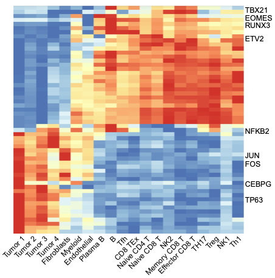
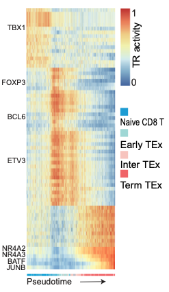
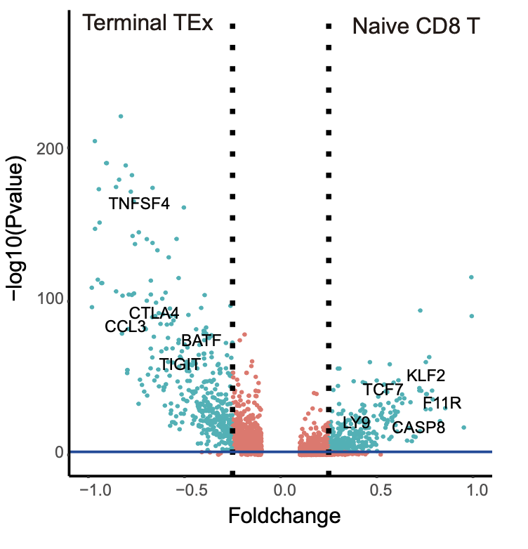

BCC Tumor Microenvironment 
======================================

We applied SCRIP to a Basal Cell Carcinoma (BCC) tumor microenvironment (TME) dataset `(Satpathy et al., Nat Biotechnol, 2019) <https://doi.org/10.1038/s41587-019-0206-z>`_ to investigate how TRs and their target genes were changed in different cell states under disease status. Data was downloaded from GEO with accession `GSE129785 <https://www.ncbi.nlm.nih.gov/geo/query/acc.cgi?acc=GSE129785>`_.

.. code:: shell

    SCRIP enrich -i example/TME/data/BCC_peak_count.h5 -s hs -p example/TME/BCC_SCRIP -t 32
    SCRIP enrich -i example/TME/data/Tcell_peak_count.h5 -s hs -p example/TME/Tcell_SCRIP -t 32

.. code:: r

    library(Seurat)
    library(plyr)
    library(patchwork)
    library(dplyr)
    library(pheatmap)
    library(stringr)

    se <- readRDS("example/TME/data/scATAC_TME_All_SummarizedExperiment.final.rds")
    all_tumor_table <- read.table("example/TME/BCC_SCRIP/enrichment/SCRIP_enrichment.txt")
    all_tumor_table_norm <- all_tumor_table

    cluster <- mapvalues(rownames(all_tumor_table_norm),se@colData@listData[["Group_Barcode"]],se@colData@listData[["Clusters"]])
    rownames(all_tumor_table_norm) <- paste(cluster,1:length(rownames(all_tumor_table_norm)),sep = "_") 
    all_tumor_table_norm <- apply(all_tumor_table_norm, 2, function (x) (x-min(x))/(max(x)-min(x)))

    all_tumor_seurat <- CreateSeuratObject(counts = t(all_tumor_table_norm),project = "tumor")
    all_tumor_seurat <- NormalizeData(all_tumor_seurat)
    all.genes <- rownames(all_tumor_seurat)
    all_tumor_seurat <- ScaleData(all_tumor_seurat, features = all.genes)

    cluster_all <- c("Cluster17","Cluster18","Cluster19","Cluster20")
    cluster_normal <- paste("Cluster",c(1:16),sep = "")
    bcc_tf <- vector("list",length(cluster_all))
    for (i in seq_along(cluster_all)) {
        cluster_markers <- FindMarkers(all_tumor_seurat, 
                                        ident.1 = cluster_all[i], 
                                        ident.2 = cluster_normal,
                                        logfc.threshold = 1)
        bcc_tf[[i]] <- rownames(cluster_markers)
    }

    cell_cluster <- paste("Cluster",1:20,sep = "")
    cell_cluster_type <- c("Naive CD4 T","TH17","Tfh","Treg","Naive CD8 T","Th1","Memory CD8 T","CD8 TEx","Effector CD8 T",
                            "NK1","NK2","B","Plasma B","Myeloid","Endothelial","Fibroblasts","Tumor 1","Tumor 2","Tumor 3","Tumor 4")
    bcc_tf <- bcc_tf[bcc_tf %in% colnames(all_tumor_table)]
    tumor_type <-  as.data.frame(cbind(cluster = se@colData@listData[["Clusters"]],barcode = se@colData@listData[["Group_Barcode"]]))
    tumor_cell_f <- all_tumor_table[,bcc_tf]
    tumor_cell_f$barcode <- rownames(tumor_cell_f)
    tem <- inner_join(tumor_cell_f,tumor_type,by = "barcode")
    TF_mean <- as.data.frame(group_by(tem,cluster) %>% summarise_each(funs = mean))
    rownames(TF_mean) <- mapvalues(TF_mean$cluster,cell_cluster,cell_cluster_type)
    TF_mean <- TF_mean[,-c(1,length(TF_mean))]

    TF_mean <- apply(TF_mean, 2, function (x) (x-min(x))/(max(x)-min(x)))
    all_tumor <- pheatmap(t(TF_mean), border_color= NA, fontsize_row = 13, fontsize_col = 17, treeheight_col = 0, treeheight_row = 0)

.. code:: r

    library(Matrix)
    library(SummarizedExperiment)
    library(matrixStats)
    library(magrittr)
    library(edgeR)
    library(TTR)
    set.seed(1)

    tcell_table_tra <- read.table("example/TME/Tcell_SCRIP/enrichment/SCRIP_enrichment.txt")

    trajectory <- paste0("Cluster",c(13,15,16,17))
    df <- data.frame(row.names = colnames(se), x = colData(se)$UMAP1, y = colData(se)$UMAP2, Group = colData(se)$T_Cell_Cluster)
    trajAligned <- alignTrajectory(df, trajectory)
    df2 <- trajAligned[[1]]
    map <- mapvalues(x = rownames(tcell_table_tra), from = se@colData@listData[["Group_Barcode"]], to = se@colData@listData[["Internal_Name"]])
    rownames(tcell_table_tra) <- map
    df2 <- df2[order(df2$pseudotime), ] 
    pseudotime_index <- rownames(df2)
    test_omit_table <- tcell_table_tra[pseudotime_index,]
    test_omit_table <- na.omit(test_omit_table)
    psudotime_table <- df2[rownames(test_omit_table),]

    # rename enrichment_table rownames to their cluster and normalization，construct Seurat object
    cluster <- mapvalues(rownames(tcell_table_norm),se@colData@listData[["Group_Barcode"]],se@colData@listData[["T_Cell_Cluster"]])
    rownames(tcell_table_norm) <- paste(cluster,1:length(rownames(tcell_table_norm)),sep = "_")
    tcell_table_norm <- apply(tcell_table_norm, 2, function (x) (x-min(x))/(max(x)-min(x)))
    cluster_tcell_seurat <- CreateSeuratObject(counts = t(tcell_table_norm))
    cluster_tcell_seurat <- NormalizeData(cluster_tcell_seurat)
    all.genes <- rownames(cluster_tcell_seurat)
    cluster_tcell_seurat <- ScaleData(cluster_tcell_seurat, features = all.genes)

    # calculate specific TF of naivet，earlyTEx，interTEx，TEx 
    cluster_markers_naivet <- FindMarkers(cluster_tcell_seurat, 
                                    ident.1 = "Cluster13", 
                                    ident.2 = c("Cluster15","Cluster16","Cluster17"),
                                    only.pos = TRUE,
                                    logfc.threshold = 0.1)
    cluster_markers_naivet <- cluster_markers_naivet[order(cluster_markers_naivet$avg_log2FC,decreasing = T), ][c(1:25),]

    cluster_markers_earlyTEx <- FindMarkers(cluster_tcell_seurat, 
                                    ident.1 = "Cluster15", 
                                    ident.2 = c("Cluster13","Cluster16","Cluster17"),
                                    only.pos = TRUE,
                                    logfc.threshold = 0.1)
    cluster_markers_earlyTEx <- cluster_markers_earlyTEx[order(cluster_markers_earlyTEx$avg_log2FC,decreasing = T), ][c(1:25),]

    cluster_markers_interTEx <- FindMarkers(cluster_tcell_seurat, 
                                    ident.1 = "Cluster16", 
                                    ident.2 = c("Cluster13","Cluster15","Cluster17"),
                                    only.pos = TRUE,
                                    logfc.threshold = 0.1)
    cluster_markers_interTEx <- cluster_markers_interTEx[order(cluster_markers_interTEx$avg_log2FC,decreasing = T), ][c(1:25),]

    cluster_markers_TEx <- FindMarkers(cluster_tcell_seurat, 
                                    ident.1 = "Cluster17", 
                                    ident.2 = c("Cluster13","Cluster15","Cluster16"),
                                    only.pos = TRUE,
                                    logfc.threshold = 0.1)
    cluster_markers_TEx <- cluster_markers_TEx[order(cluster_markers_TEx$avg_log2FC,decreasing = T), ][c(1:25),]
    tcell_tf <- unique(c(rownames(cluster_markers_naivet),rownames(cluster_markers_earlyTEx),rownames(cluster_markers_interTEx),rownames(cluster_markers_TEx)))

    plot_table <- tcell_table_tra[rownames(psudotime_table),c(tcell_tf)]
    plot_table <- na.omit(plot_table)
    for (i in seq_along(plot_table)) {
    t <- ts(plot_table[,i])
    plot_table[,i] <- SMA(t,n=8)
    
    }
    plot_table <- plot_table[-c(1:7),]
    plot_table <- apply(plot_table, 2, function (x) (x-min(x))/(max(x)-min(x)))

    tcell_cluster <- c("Cluster13","Cluster15","Cluster16","Cluster17")
    tcell_cluster_type <- c("Naive CD8 T","Early TEx","Intermediate TEx","Terminal TEx")
    psudotime_table$Group <- mapvalues(psudotime_table$Group,tcell_cluster,tcell_cluster_type)
    plot_anno <- select(psudotime_table,Group)
    plot_anno <- slice(plot_anno,8:length(rownames(plot_anno)))
    ann_colors = list(
    CellType = c("Naive CD8 T" = "#00AEEC", "Early TEx" = "#b2f7ef","Intermediate TEx" = "#fcd5ce","Terminal TEx" ="#FF6D6F")
    )
    t <- pheatmap(t(plot_table),border=FALSE,annotation_colors = ann_colors,annotation_col =  plot_anno,legend_breaks = c(1,0),fontsize_row = 20,cellheight = 17,cellwidth = 0.055,cluster_rows = FALSE,cluster_cols = FALSE,fontsize_col = 10,show_colnames = F,treeheight_row  = 0)

.. code:: shell

    SCRIP impute -i example/TME/data/Tcell_peak_count.h5 -s hs -p example/TME/Tcell_SCRIP/ -f h5 --factor JUNB
    SCRIP target -i example/TME/Tcell_SCRIP/imputation/imputed_JUNB.h5ad -s hs -o JUNB_target.h5ad

.. code:: r

    cluster_markers_all <- FindMarkers(naive_tex_seurat, 
                                     ident.1 = "Cluster13", 
                                     ident.2 = "Cluster17",
                                     logfc.threshold = 0.1)
    volcano <- cluster_markers_all[,c(1,2)]
    colnames(volcano) <- c("Pvalue","Foldchange")
    threshold<-as.factor((volcano$Foldchange>0.25|volcano$Foldchange<(-0.25))&volcano$Pvalue<0.01)
    r = ggplot(volcano,aes(Foldchange,-log10(Pvalue),colour=threshold)) +
        geom_point() +
        labs(title="Volcanoplot") +
        theme(plot.title = element_text(hjust = 0.25)) +
        xlim(-1,1) +
        theme_classic() +
        geom_vline(xintercept=c(-0.25,0.25),linetype="dotted",size=1) +
        geom_hline(yintercept=-log10(0.01),col="blue")
    r

.. code:: r

    library(plyr)
    library(ggplot2)
    library(Seurat)
    library(clusterProfiler)
    library(org.Hs.eg.db)
    library(dplyr)

    tex_use<-Read10X("example/TME/Tcell_SCRIP/imputation/JUNB_10x",gene.column =1)
    tex_USE<-t(tex_use)

    tex_ENTREZID<-c()
    GO <- g_n
    for (i in GO){
    t<-unique((as.character(unlist(strsplit(GO[i,8],split="/")))))
    tex_ENTREZID<-append(tex_ENTREZID,t)
    tex_ENTREZID<-unique(tex_ENTREZID)
    }
    tex_trans <- bitr(tex_ENTREZID, fromType="ENTREZID", toType=c("SYMBOL"), OrgDb="org.Hs.eg.db")

    eg_naive <- bitr(naive_target, 
                 fromType="SYMBOL", 
                 toType=c("ENTREZID","ENSEMBL",'SYMBOL'),
                 OrgDb="org.Hs.eg.db")
    go_naive <- enrichGO(eg_naive$ENTREZID, 
                        OrgDb = org.Hs.eg.db, 
                        ont='BP',
                        pAdjustMethod = 'BH',
                        pvalueCutoff = 0.1,
                        keyType = 'ENTREZID')
    go_naive <- go_naive[order(go_naive[,9],decreasing = TRUE),]

    eg_tex <- bitr(tex_target, 
               fromType="SYMBOL", 
               toType=c("ENTREZID","ENSEMBL",'SYMBOL'),
               OrgDb="org.Hs.eg.db")
    # Run GO enrichment analysis 
    go_tex <- enrichGO(eg_tex$ENTREZID, 
                    OrgDb = org.Hs.eg.db, 
                    ont='BP',
                    pAdjustMethod = 'BH',
                    pvalueCutoff = 0.1,
                    keyType = 'ENTREZID')
    go_tex <- go_tex[order(go_tex[,9],decreasing = TRUE),]
    go_tex <- go_tex[grep("negative",go_tex$Description),][c(1:6),]

.. image:: ../_static/img/Tumors/junb_go.png
    :alt: JUNB target heatmap
    :width: 50%
    :align: center