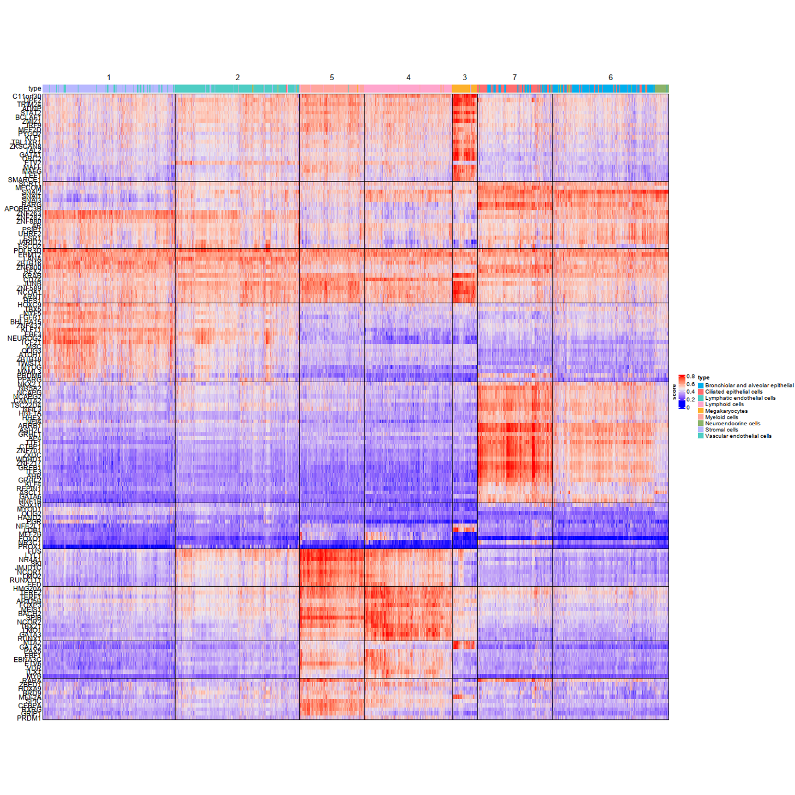
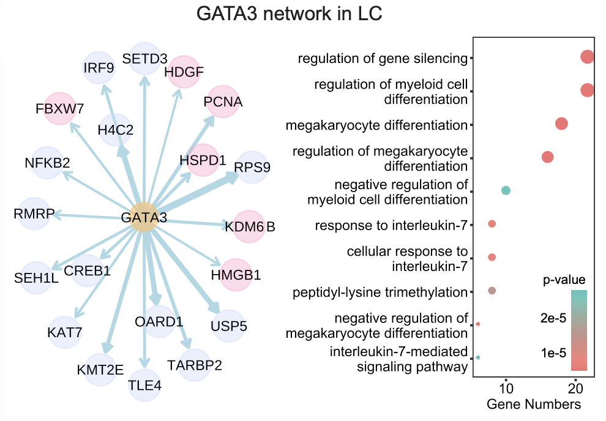

Human Fetal Organs
==============================

To prove the ability that SCRIP can be applied to diverse tissue types and infer the target genes of TRs, we applied SCRIP to a scATAC-seq dataset of human fetal organs that covers 14 different tissues `(Domcke et al., Science, 2020) <https://doi.org/10.1126/science.aba7612>`_. Data was downloaded from GEO with accession `GSE149683 <https://www.ncbi.nlm.nih.gov/geo/query/acc.cgi?acc=GSE149683>`_.

We use the lung sample as an example to suggest the process of custom analysis.

.. code:: shell

    SCRIP enrich -i example/fetal_organ/data/GSM4508936_lung.h5 -s hs -p example/fetal_organ/lung_SCRIP -t 32

.. code:: r
    
    library(Seurat)
    library(ggplot2)
    library(dplyr)
    library(ComplexHeatmap)
    library(RColorBrewer)
    library(patchwork)
    library(data.tree) 
    library(gridExtra) 
    library(rlist) 
    library(phangorn) 
    library(scales)
    library(dendextend)
    library(tidytree)
    library(ggtree)
    library(ape)
    library(phylogram)
    library(clusterProfiler)
    library(org.Hs.eg.db)
    library(igraph)
    library(ggraph)
    library(tidygraph)

    enri<-read.table("example/fetal_organ/lung_SCRIP/enrichment/SCRIP_enrichment.txt",header=T)  #25,0.5,30
    enri_b<-t(enri)
    head(enri_b)
    seurat <- CreateSeuratObject(counts = enri_b, project = "lung")
    seurat@assays$RNA@scale.data<-as.matrix(seurat@assays$RNA@counts)
    seurat <- FindVariableFeatures(seurat, selection.method = "vst", nfeatures = 2000)
    seurat <- RunPCA(seurat, features = VariableFeatures(object = seurat))
    ElbowPlot(seurat)

    seurat <- FindNeighbors(seurat, dims = 1:25)
    seurat <- FindClusters(seurat, resolution = 0.7)
    seurat <- RunUMAP(seurat, dims = 1:50)

    clusters<-seurat@active.ident
    clusters <- as.data.frame(clusters)
    clusters$cell <- rownames(clusters)

.. code:: r

    a=c("Ciliated epithelial cells","Lymphatic endothelial cells","Lymphoid cells","Megakaryocytes","Myeloid cells",
        "Neuroendocrine cells")
    b=c("Stromal cells")
    c=c("Bronchiolar and alveolar epithelial cells")
    d=c("Vascular endothelial cells")

    cluster_list <- list()
    for (i in a){
    clusters_cell <- clusters[which(clusters$clusters==i),"cell"]
    cluster_list[[i]] <- sample(clusters_cell,ceiling(length(clusters_cell)/1))
    }
    for (i in b){
    clusters_cell <- clusters[which(clusters$clusters==i),"cell"]
    cluster_list[[i]] <- sample(clusters_cell,ceiling(length(clusters_cell)/20))
    }
    for (i in c){
    clusters_cell <- clusters[which(clusters$clusters==i),"cell"]
    cluster_list[[i]] <- sample(clusters_cell,ceiling(length(clusters_cell)/10))
    }
    for (i in d){
    clusters_cell <- clusters[which(clusters$clusters==i),"cell"]
    cluster_list[[i]] <- sample(clusters_cell,ceiling(length(clusters_cell)/2.5))
    }

    selected_cells <- unlist(cluster_list)
    lung<-seurat
    lung_use<-seurat[,selected_cells]

.. code:: r

    lung.markers <- FindAllMarkers(lung_use, only.pos = TRUE, min.pct = 0.1, logfc.threshold = 0.1)
    lung.markers_use<-lung.markers %>%
        group_by(cluster) %>%
        slice_max(n = 30, order_by = avg_log2FC)
    gene<-unique(lung.markers_use$gene)
    mat <- GetAssayData(lung_use, slot = "counts")
    mat_use<-as.matrix(mat[gene,])

.. code:: r

    mycol=c("#FF6D6F","#00AEEC","#8cb369","#b8b8ff","#FEFBDD", "#FFA6CD","#cddafd","#4ecdc4","#FDB12C","#ffa69e")
    names<-as.data.frame(lung_use@active.ident)
    colnames(names)<-"cell_type"
    type=names$cell_type
    ha = HeatmapAnnotation(type = type, annotation_name_side = "left",
                        col=list(type=c("Bronchiolar and alveolar epithelial cells"=mycol[2],"Stromal cells"=mycol[4],"Vascular endothelial cells"=mycol[8],
                "Lymphoid cells"=mycol[6],"Ciliated epithelial cells"=mycol[1],"Lymphatic endothelial cells"=mycol[8],
                "Megakaryocytes"=mycol[9],"Myeloid cells"=mycol[10],"Neuroendocrine cells"=mycol[3])
            ))
    for (i in 1:150){
        min=min(mat_use[i,])
        max=max(mat_use[i,])
        for (c in 1:9417){
        mat_use[i,c]=(mat_use[i,c]-min)/(max-min)
        }
    }
    names$cell_type<-as.factor(names$cell_type)
    annotation_col =names
    options(repr.plot.width = 20, repr.plot.height = 20,repr.plot.res = 70)
    set.seed(2021)
    p<-Heatmap(mat_use,cluster_rows=TRUE,
        cluster_columns=TRUE,
        show_column_names=FALSE,
        show_row_names=TRUE,
        top_anno=ha,
        column_km=7,
        row_km = 10,
        # row_km=6,
        show_row_dend=FALSE,
        show_column_dend=FALSE,
        # right_annotation=row_anno,
        heatmap_legend_param=list(
        title="score",
        title_position="leftcenter-rot"
        ),
        row_gap = unit(0, "mm"), 
            column_gap = unit(0, "mm"),
            border = TRUE,
            width = unit(40, "cm"), 
            height = unit(40, "cm"),
            row_names_side = "left"
        )
    p

.. code:: shell

    SCRIP impute -i example/fetal_organ/data/GSM4508936_lung.h5 -s hs -p example/fetal_organ/lung_SCRIP -f h5 --factor GATA3
    SCRIP target -i example/fetal_organ/lung_SCRIP/imputation/imputed_GATA3.h5ad -s hs -o GATA3_target.h5ad

.. code:: r

    # GATA3 is expressed in Lymphoid
    Lymphoid_cells<-subset(lung_use,idents=c('Lymphoid cells'),invert=FALSE)

    # We did a extra step to convert h5ad to 10x mtx format for easily reading into R
    GATA3<-Read10X("imputation/GATA3_10x", gene.column =1)

    use_GATA3<-GATA3[,colnames(GATA3)%in%rownames(Lymphoid_cells@meta.data)]  #choose lymphoid cell in GATA3 matrix
    use_qc_GATA3<-use_GATA3[,colnames(use_GATA3)%in%rownames(as.data.frame(sort(colSums(use_GATA3),decreasing=TRUE)[1:500]))]  #cell qc
    Lymphoid_use_GATA3<-as.data.frame(sort(rowMeans(use_qc_GATA3),decreasing = TRUE)[1:1000]) #gene qc
    eg_gata3_ly <- bitr(rownames(Lymphoid_use_GATA3), fromType="SYMBOL", toType=c("ENTREZID"), OrgDb="org.Hs.eg.db")

    go_gata3_ly<-enrichGO(eg_gata3_ly$ENTREZID, OrgDb = org.Hs.eg.db, ont='BP',
               pAdjustMethod = 'BH',
               qvalueCutoff = 0.05,
               keyType = 'ENTREZID')

