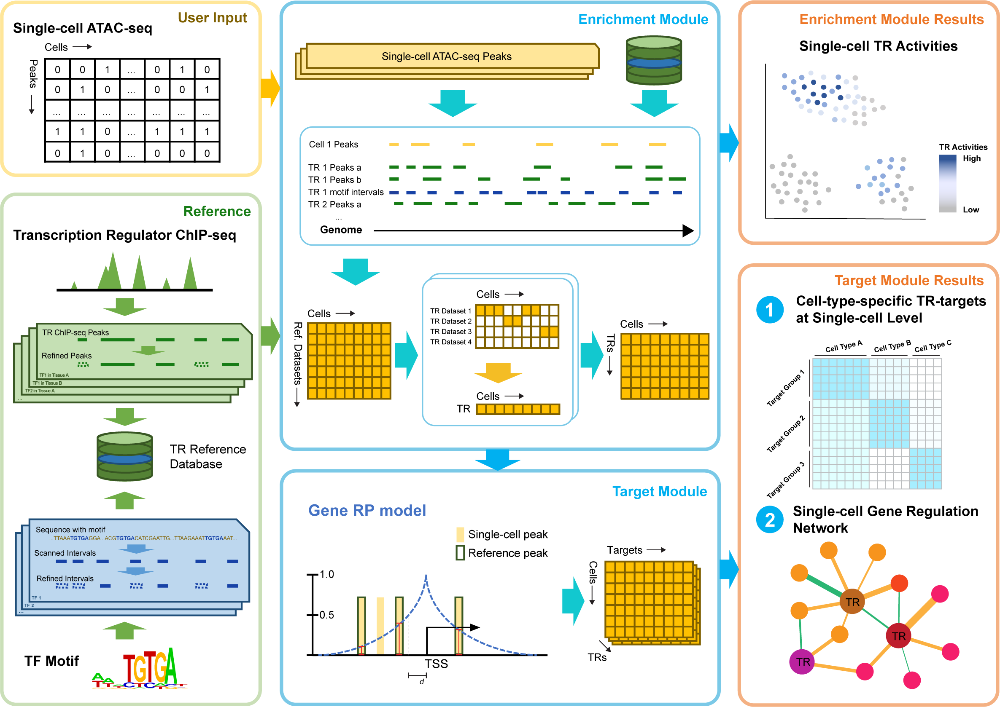

.. SCRIP documentation master file, created by
   sphinx-quickstart on Tue Aug  3 19:13:29 2021.
   You can adapt this file completely to your liking, but it should at least
   contain the root `toctree` directive.

Welcome to SCRIP's documentation!
==================================

.. toctree::
   :maxdepth: 2
   :caption: Contents:

|Docs| |pypi|

.. |Docs| image:: https://readthedocs.org/projects/scrip/badge/?version=latest
   :target: https://scrip.readthedocs.io

.. |pypi| image:: https://badge.fury.io/py/SCRIP.svg

SCRIP (Single Cell Regulatory network Inference using ChIP-seq & motif) is a toolkit for elucidating the gene regulation pattern based on scATAC-seq leveraing a huge amount of bulk ChIP-seq data. It supports (1) evaluating the TR activities in single-cell based on the integration of the scATAC-seq dataset and curated reference; (2) determining the target genes of TR at single-cell resolution; (3) constructing the GRN in single-cell and identifying cell-specific regulation.

.. toctree::
   :maxdepth: 1
   :hidden:

   installation
   usage
   examples
   release_notes
